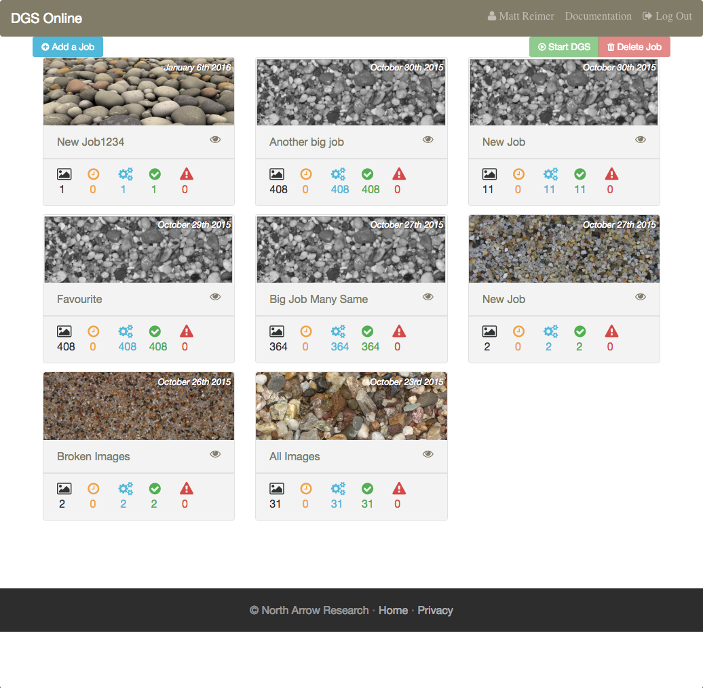
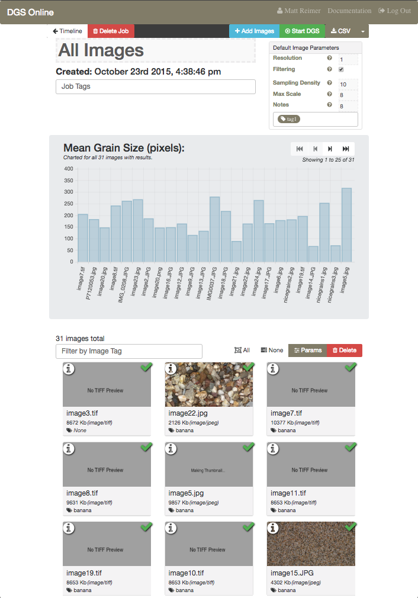
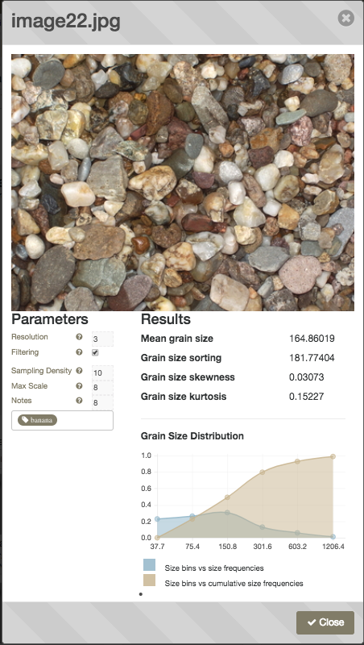

In 2015 pyDGS was incorporated into a fully-automated online service using AWS Lambda and EC2 to run python jobs in the cloud.

Ultimately this service was taken down in 2018 due, in part, to low adoption and cost of keeping it online. pyDGS is still available as a `pip` module for doing image processing offline and we actively encourage everyone to keep using it that way going forward.

See our [help pages and README file](../) for instructions on getting started with pyDGS as a `pip` module

### Screenshots of the online Service in action:

